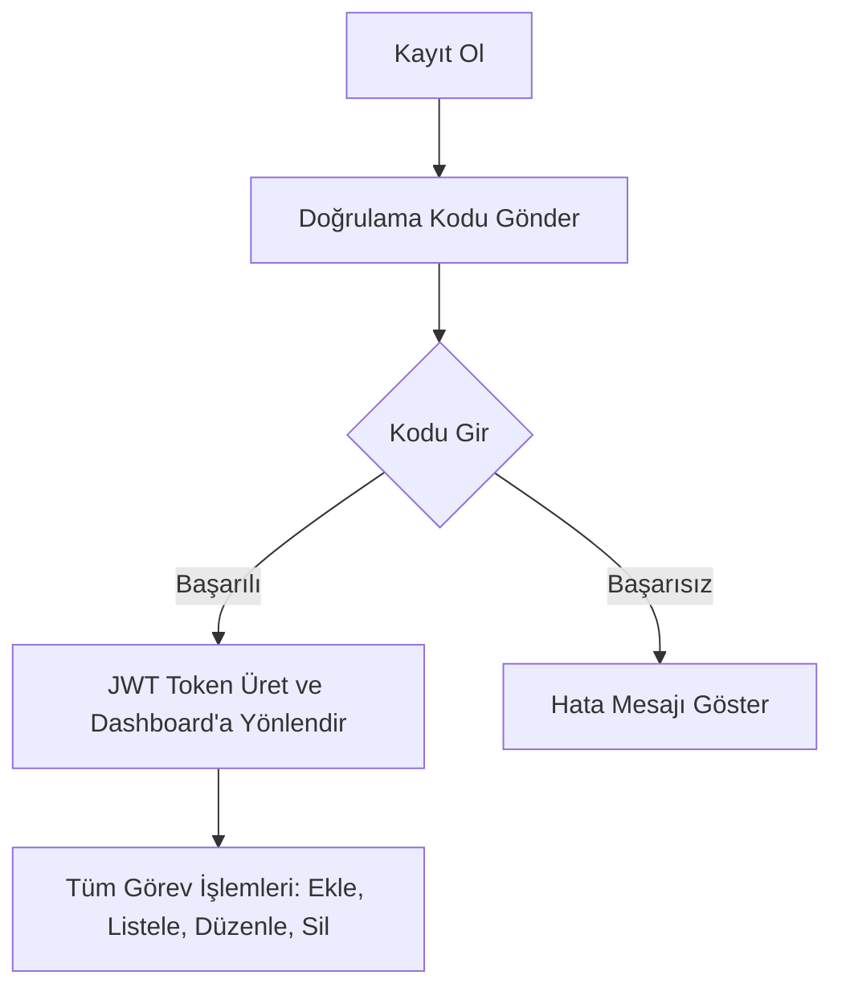

# CRM Task Uygulaması - Detaylı Teknik Döküman

## 📌 Genel Proje Tanımı

Bu proje, kullanıcı kaydı, e-posta doğrulaması, JWT tabanlı oturum yönetimi ve kullanıcıya özel görev (task) yönetimi sunan **CRM Task Uygulamasıdır**.

- Kullanıcılar kayıt olduklarında e-posta adreslerine bir doğrulama **kodu** ve **doğrulama linki** gönderilir.
- Kod veya link aracılığıyla doğrulama başarılı olursa kullanıcı sisteme giriş yapabilir.
- Ardından görev ekleme, listeleme, düzenleme ve silme işlemleri yapılabilir.

---

## 🛠 Kullanılan Teknolojiler (Tech Stack)

| Teknoloji | Kullanım Amacı |
|:----------|:---------------|
| Next.js (App Router) | Fullstack uygulama çatısı |
| React.js | Client taraflı sayfa ve bileşen yönetimi |
| MySQL | Veritabanı yönetimi |
| DBeaver | Yerel veritabanı yönetimi aracı |
| JWT (jsonwebtoken) | Oturum yönetimi |
| Nodemailer | E-posta gönderimi |
| Bootstrap 5 | Responsive tasarım |
| PlanetScale (opsiyonel) | Üretim ortamı veritabanı (scalable MySQL) |

---

## 📂 Proje Modülleri ve Açıklamaları

### 1. Kullanıcı Kayıt (/api/auth/register.js)
- Kullanıcı email ve şifre ile kayıt olur.
- Şifre **bcrypt** ile hashlenir.
- E-posta adresine **doğrulama kodu** ve **doğrulama linki** gönderilir.
- Kullanıcı **is_verified = false** olarak kaydedilir.

> Kullanılan: MySQL, bcrypt, nodemailer, jwt

---

### 2. Kod ile Doğrulama (/api/auth/verify-code.js)
- Kullanıcı 6 haneli doğrulama kodunu girer.
- Kod doğrulanırsa:
  - Kullanıcı **is_verified = true** yapılır.
  - JWT Token üretilir ve Cookie olarak gönderilir.

> Kullanılan: MySQL, jwt, cookie

---

### 3. Link ile Doğrulama (/api/auth/verify-link.js)
- Kullanıcı doğrulama linkine tıklar.
- JWT çözülerek kullanıcı bulunur ve doğrulama yapılır.
- Başarılı ise kullanıcı **dashboard** sayfasına yönlendirilir.

> Kullanılan: jwt, cookie, MySQL

---

### 4. Kullanıcı Girişi (/api/auth/login.js)
- Email ve şifre ile giriş yapılır.
- Kullanıcı doğrulandıysa:
  - JWT Token üretilir ve Cookie'ye yazılır.
- Doğrulanmamışsa:
  - "Lütfen hesabınızı doğrulayın." hatası döner.

> Kullanılan: MySQL, bcrypt, jwt, cookie

---

### 5. Oturum Bilgisi (/api/auth/me.js)
- Cookie içindeki JWT Token çözülenir.
- Kullanıcı bilgileri döndürülür.

---

### 6. Çıkış Yapma (/api/auth/logout.js)
- Kullanıcının Cookie'sindeki JWT token temizlenir.
- Oturum kapatılır.

---

### 7. Kod Yeniden Gönderme (/api/auth/resend-code.js)
- Kullanıcıya yeni bir doğrulama kodu gönderilir.
- Eski kod güncellenir.

---

## 📝 Görev (Task) Yönetim Modülleri

### 8. Görev Ekleme (/api/tasks/create.js)
- Kullanıcı görev başlığı ve açıklaması girer.
- Görev, oturumdaki kullanıcıya bağlı olarak veritabanına kaydedilir.

---

### 9. Görev Listeleme (/api/tasks/list.js)
- Yalnızca oturum açmış kullanıcıya ait görevler listelenir.

---

### 10. Görev Düzenleme (/api/tasks/update.js)
- Seçilen görev güncellenir.

---

### 11. Görev Silme (/api/tasks/delete.js)
- Seçilen görev veritabanından kalıcı olarak silinir.

---

## 👥 Frontend Sayfa Akışı

| Sayfa | Açıklama |
|:------|:---------|
| `/login` | Kullanıcı girişi |
| `/register` | Kullanıcı kaydı |
| `/verify` | Kod ile doğrulama |
| `/verify-link` | Link ile doğrulama |
| `/dashboard` | Görev yönetim ekranı |

---

## 🛠 Ekstra Kullanılanlar

- **Toastify:** Bildirim mesajları için.
- **Bootstrap 5:** Responsive frontend tasarım için.
- **Next.js App Router:** Yeni nesil dizin ve sayfa yönetimi için.

---

## 🛡️ .env Örnek Yapısı

```env
DB_HOST=localhost
DB_USER=root
DB_PASSWORD=senin_passwordun
DB_NAME=crm_task_app
EMAIL_USER=senin.email@gmail.com
EMAIL_PASS=uygulama_sifresi
JWT_SECRET=senin_secret_token
NEXT_PUBLIC_APP_URL=http://localhost:3000
```

---

## 🚀 Deployment Bilgileri

- Proje GitHub'a yüklendi.
- Vercel üzerinden deployment yapıldı.
- Vercel'de Environment Variables ayarlandı.

---

## 🔗 Genel Akış Şeması



---

## 🎯 Özet

- Kullanıcılar, email doğrulaması ile güvenli giriş yapar.
- JWT tabanlı oturum sistemi vardır.
- Görev yönetimi tamamen kullanıcıya özeldir.
- Sistem tamamen responsive ve güvenli çalışacak şekilde tasarlanmıştır.
